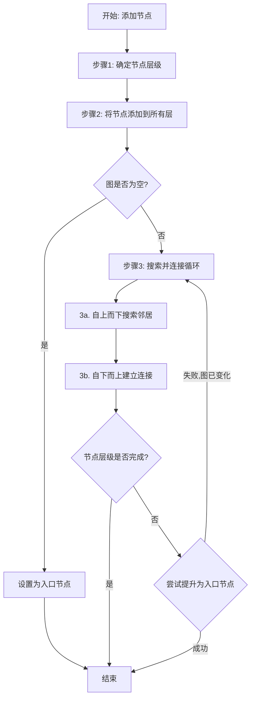
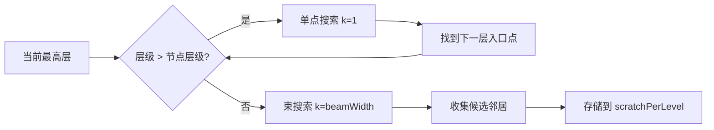
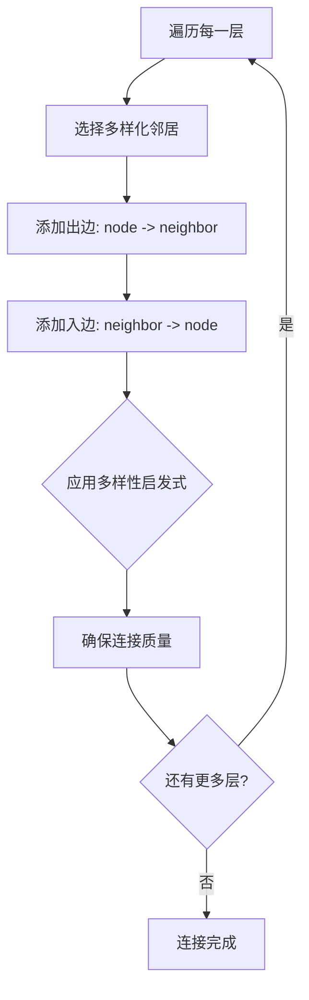
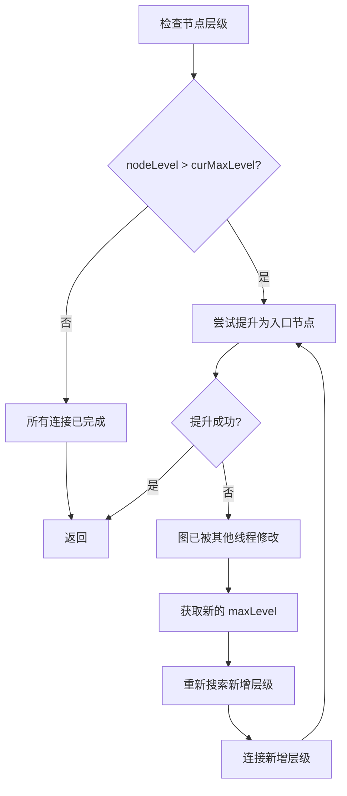
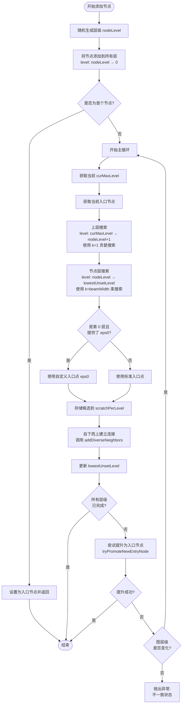
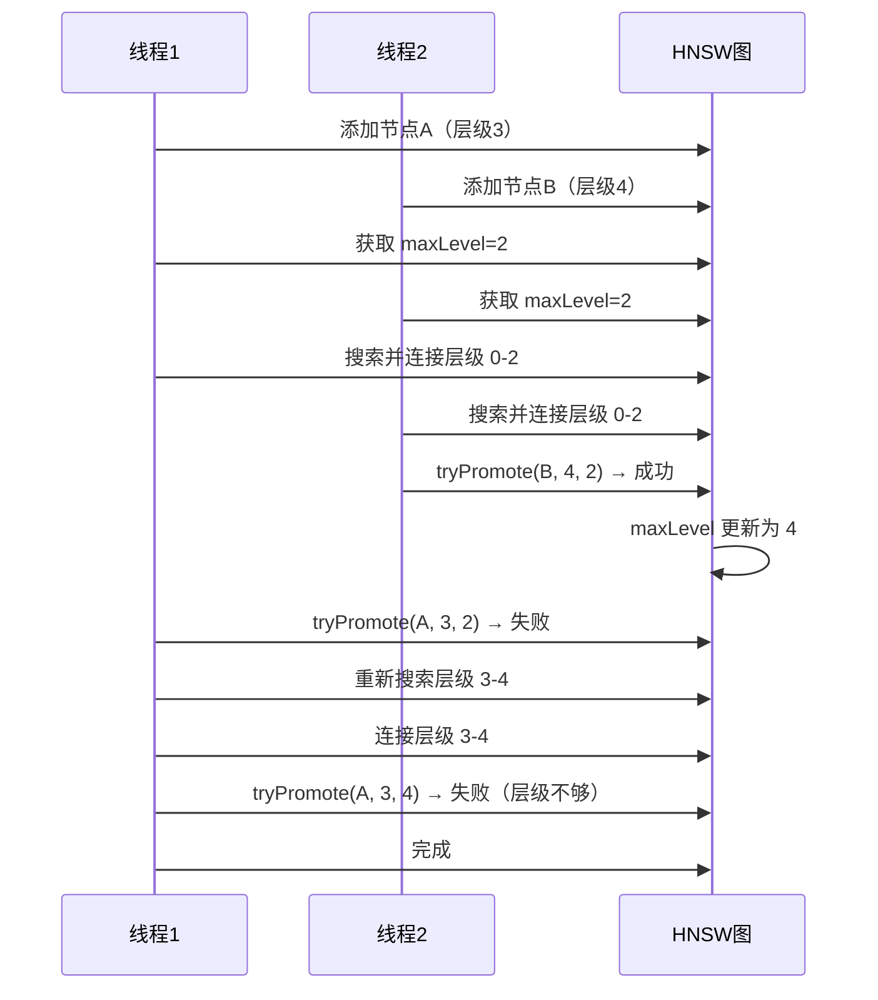
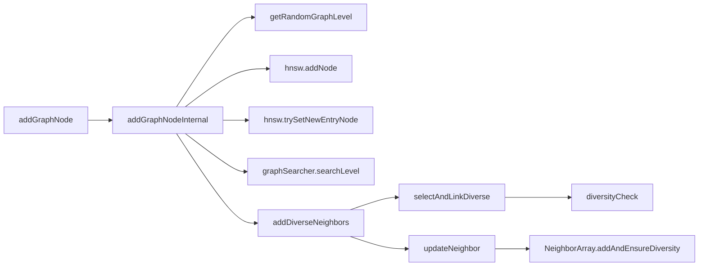

# HnswGraphBuilder.addGraphNodeInternal 方法详细分析

## 概述

`addGraphNodeInternal` 方法是 HNSW（分层可导航小世界）图构建的核心实现。该方法负责将新节点插入到多层 HNSW 图结构中，同时保持图的可导航性和搜索效率特性。

**位置**: `org.apache.lucene.util.hnsw.HnswGraphBuilder#addGraphNodeInternal`

## 方法签名

```java
private void addGraphNodeInternal(int node, UpdateableRandomVectorScorer scorer, IntHashSet eps0)
    throws IOException
```

### 参数说明

- **node**: 要添加的节点 ID
- **scorer**: 可更新的随机向量评分器，用于计算节点间的相似度
- **eps0**: 可选参数，指定在第 0 层搜索的入口点集合（在合并场景中很有用）

## 线程安全性

- ✅ 当图大小固定时线程安全（例如在合并操作期间）
- ✅ 多个构建器可以同时在同一个图上工作（如果预先知道大小）
- ⚠️ 普通构建场景下不是线程安全的

## 算法流程

### 整体架构图



### 详细步骤分解

#### 步骤 1: 随机确定节点层级（第 238 行）

```java
final int nodeLevel = getRandomGraphLevel(ml, random);
```

- 使用指数分布随机生成节点的最高层级
- 层级越高，节点越少（形成层次结构）
- 计算公式: `level = -log(random) * ml`，其中 `ml = 1/ln(M)`

#### 步骤 2: 将节点添加到所有层（第 240-242 行）

```java
for (int level = nodeLevel; level >= 0; level--) {
  hnsw.addNode(level, node);
}
```

- 从最高层到第 0 层，将节点添加到每一层
- 此时节点是孤立的，没有任何边连接
- 这确保了节点在图中的原子可见性

#### 步骤 3: 处理首个节点特殊情况（第 245-247 行）

```java
if (hnsw.trySetNewEntryNode(node, nodeLevel)) {
  return;
}
```

- 如果图为空，该节点成为图的入口点
- 提前返回，无需建立连接

#### 步骤 4: 主搜索和连接循环（第 253-319 行）

这是最复杂的部分，处理并发图修改的情况。

##### 4a. 自上而下搜索阶段



**上层搜索（第 264-270 行）**:
```java
for (int level = curMaxLevel; level > nodeLevel; level--) {
  candidates.clear();
  graphSearcher.searchLevel(candidates, scorer, level, eps, hnsw, null);
  eps[0] = candidates.popNode(); // 贪婪选择最近的一个
}
```
- 目标: 为节点所在层找到最佳入口点
- 使用 `entryCandidates` (k=1) 进行贪婪搜索
- 每层只保留最优的一个节点作为下一层的入口

**节点层搜索（第 272-287 行）**:
```java
for (int i = scratchPerLevel.length - 1; i >= 0; i--) {
  int level = i + lowestUnsetLevel;
  candidates.clear();
  if (level == 0 && eps0 != null && eps0.size() > 0) {
    eps = eps0.toArray();
    candidates = beamCandidates0;
  }
  graphSearcher.searchLevel(candidates, scorer, level, eps, hnsw, null);
  eps = candidates.popUntilNearestKNodes();
  scratchPerLevel[i] = new NeighborArray(Math.max(candidates.k(), M + 1), false);
  popToScratch(candidates, scratchPerLevel[i]);
}
```
- 使用束搜索（beam search）收集候选邻居
- 第 0 层特殊处理: 如果提供了 `eps0`，使用自定义入口点
- 将候选结果存储在 `scratchPerLevel` 数组中，用于后续连接

##### 4b. 自下而上连接阶段（第 289-293 行）

```java
for (int i = 0; i < scratchPerLevel.length; i++) {
  addDiverseNeighbors(i + lowestUnsetLevel, node, scratchPerLevel[i], scorer, false);
}
```

**关键设计决策**:
- ✅ 从最低层（第 0 层）向上建立连接
- ✅ 先建立所有出边（outgoing links），再建立入边（incoming links）
- 🎯 **原因**: 确保节点一旦被发现就是可达的，防止死锁路径

**连接流程图**:



#### 步骤 5: 入口节点提升逻辑（第 295-319 行）

```java
if (lowestUnsetLevel == nodeLevel + 1) {
  return; // 所有层级已完成
}
assert lowestUnsetLevel == curMaxLevel + 1 && nodeLevel > curMaxLevel;
if (hnsw.tryPromoteNewEntryNode(node, nodeLevel, curMaxLevel)) {
  return; // 成功提升为入口节点
}
```

**场景分析**:

| 条件 | 行为 |
|------|------|
| 节点层级 ≤ 图最大层级 | 直接返回，任务完成 |
| 节点层级 > 图最大层级 | 尝试提升为新入口节点 |
| 提升成功 | 返回，任务完成 |
| 提升失败（并发修改）| 重新进入循环，处理新增层级 |

**并发处理流程**:



## 关键设计模式

### 1. 并发修改处理

```java
do {
  curMaxLevel = hnsw.numLevels() - 1;
  int[] eps = new int[] {hnsw.entryNode()};
  // ... 搜索和连接逻辑
  if (hnsw.tryPromoteNewEntryNode(node, nodeLevel, curMaxLevel)) {
    return;
  }
  // 检测到并发修改，重试
} while (true);
```

- 使用 `do-while` 循环处理图层级变化
- 类似 CAS（Compare-And-Swap）的重试机制
- 确保最终一致性

### 2. 逐层处理策略


- **搜索**: 自上而下（top-down）
- **连接**: 自下而上（bottom-up）
- **优势**: 保证搜索准确性，优化连接顺序

### 3. 多样性启发式（Diversity Heuristic）

在 `addDiverseNeighbors` 方法中实现，确保：
- ✅ 避免聚簇连接（clustered connections）
- ✅ 保持图的可导航性
- ✅ 提高搜索效率

**多样性检查逻辑**:
```java
private boolean diversityCheck(float score, NeighborArray neighbors, RandomVectorScorer scorer) {
  for (int i = 0; i < neighbors.size(); i++) {
    float neighborSimilarity = scorer.score(neighbors.nodes()[i]);
    if (neighborSimilarity >= score) {
      return false; // 新候选与已选邻居太相似，拒绝
    }
  }
  return true; // 多样性检查通过
}
```

### 4. 自定义入口点优化

`eps0` 参数允许在第 0 层使用自定义入口点：
- 🎯 **应用场景**: 段合并（segment merging）
- 🎯 **优势**: 利用先验知识，减少搜索时间
- 🎯 **实现**: 在 `MergingHnswGraphBuilder` 中使用

## 重要变量说明

| 变量名 | 类型 | 作用 |
|--------|------|------|
| `nodeLevel` | int | 节点的最高层级 |
| `curMaxLevel` | int | 当前图的最大层级（动态变化）|
| `lowestUnsetLevel` | int | 跟踪哪些层级还需要建立连接 |
| `scratchPerLevel` | NeighborArray[] | 存储每层的候选邻居 |
| `eps` | int[] | 每层搜索的入口点数组 |
| `entryCandidates` | GraphBuilderKnnCollector | 上层单点搜索收集器（k=1）|
| `beamCandidates` | GraphBuilderKnnCollector | 节点层束搜索收集器（k=beamWidth）|
| `beamCandidates0` | GraphBuilderKnnCollector | 第 0 层优化的搜索收集器 |

## 完整执行流程图



## 性能特征

### 时间复杂度

- **平均情况**: O(log(N) × beamWidth × M)
  - log(N): 层级数量
  - beamWidth: 束搜索宽度（默认 100）
  - M: 每个节点的最大连接数（默认 16）

- **最坏情况**: O(N × beamWidth × M)
  - 当图退化为单层时

### 空间复杂度

- **临时存储**: O(nodeLevel × beamWidth)
  - `scratchPerLevel` 数组的大小

- **图存储**: O(N × M)
  - N 个节点，每个最多 M 个连接（第 0 层 2M）

### 搜索效率

| 参数 | 默认值 | 影响 |
|------|--------|------|
| beamWidth | 100 | 搜索质量 vs 速度权衡 |
| M | 16 | 图密度和内存使用 |
| ml | 1/ln(M) | 层级分布的归一化因子 |

## 线程安全机制详解

### 1. 原子可见性保证

```java
// 先添加到所有层（无连接）
for (int level = nodeLevel; level >= 0; level--) {
  hnsw.addNode(level, node);
}
// 后建立连接
addDiverseNeighbors(...);
```

- 节点在建立连接前对所有线程可见
- 避免部分可见的不一致状态

### 2. 连接顺序保证

```java
// 1. 先添加所有出边（node → neighbors）
neighbors.addInOrder(cNode, cScore);

// 2. 再添加入边（neighbors → node）
updateNeighbor(hnsw.getNeighbors(level, nbr), node, ...);
```

- 确保节点一旦可达，就有出路
- 防止搜索陷入死胡同

### 3. CAS 风格的入口节点更新

```java
if (hnsw.tryPromoteNewEntryNode(node, nodeLevel, curMaxLevel)) {
  return; // 成功
}
// 失败则重试整个流程
```

- 原子的比较并交换操作
- 失败时自动重试

### 4. 并发场景示例



## 最佳实践与注意事项

### ✅ 适用场景

1. **批量构建**: 一次性添加大量向量
2. **增量更新**: 逐个添加新向量到现有图
3. **段合并**: 使用 `eps0` 参数优化合并性能

### ⚠️ 性能调优

1. **beamWidth 调优**:
   - 增大 → 提高召回率，降低速度
   - 减小 → 提高速度，降低召回率
   - 推荐: 100-200 之间

2. **M 值选择**:
   - 增大 → 提高图密度和召回率，增加内存
   - 减小 → 减少内存，可能降低召回率
   - 推荐: 12-48 之间

3. **并发控制**:
   - 固定大小图 → 可多线程构建
   - 动态增长图 → 单线程构建

### 🔍 调试技巧

1. **启用日志**:
```java
builder.setInfoStream(InfoStream.getDefault());
```

2. **监控指标**:
   - 每层节点分布
   - 平均连接数
   - 搜索跳数

## 相关方法调用链



## 总结

`addGraphNodeInternal` 方法是 HNSW 图构建的核心，体现了：

1. **精巧的并发设计**: 在保证线程安全的同时支持并发构建
2. **高效的搜索策略**: 层次化搜索 + 束搜索的完美结合
3. **质量保证机制**: 多样性启发式确保图的高质量
4. **容错性**: 自动处理并发修改和重试

这个方法是理解 HNSW 算法实现的关键，也是 Lucene 向量搜索能力的基石。

## 参考资料

- [HNSW 原始论文](https://arxiv.org/abs/1603.09320): Efficient and robust approximate nearest neighbor search using Hierarchical Navigable Small World graphs
- Lucene HNSW 实现: `org.apache.lucene.util.hnsw` 包
- 相关类: `OnHeapHnswGraph`, `HnswGraphSearcher`, `NeighborArray`
